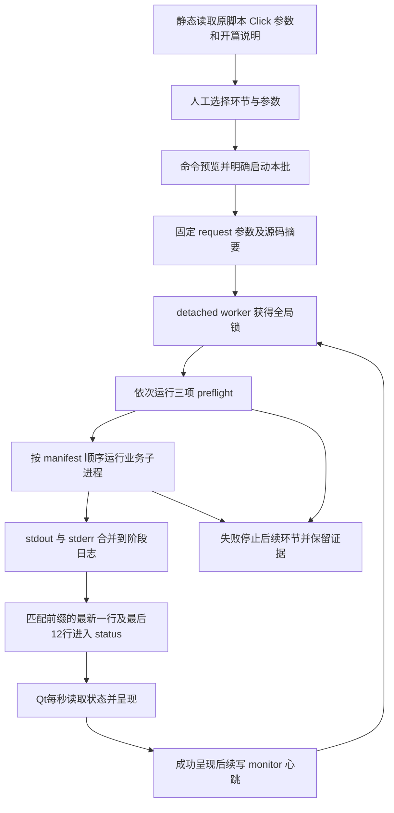

# 总控台监控链路审计与进度改造草案

审计日期：2026-09-29。范围：PySide6 总控台、worker、19 个正式采集入口的规划、请求、验收、提交及失败路径。

本文是本次代码阅读的审计结果与待实施方案，不是新的项目规范，不代表已实现。行号对应审计时的工作区；业务修改应在 Notebook 完成，再用默认 PythonExporter 导出。未执行采集、调用业务 API、写入正式湖或修改历史证据。

## 1. 结论与最近批次证据

当前监控已经具备子进程监督、完整输出落盘、心跳和脚本级状态，但尚未具备真正的业务进度展示。19 个业务入口普遍已有丰富日志，不需要重新给所有函数机械添加日志。主要缺口是控制面只保留一条进度文本和 12 行输出；这些输出中的层级、数量、单位和事务含义没有进入界面。

最近批次 `console-20260928T214816Z-fa2c8b94` 在北京时间 **2026-09-29 05:48:17—05:48:31** 运行，终态 `failed`，停在第三项 preflight：Notebook 导出同步检查。前一批 `console-20260928T213057Z-6879cb16` 也是同一原因。

最新批次的三份日志均是 preflight 日志，尚未启动任何业务环节。因此没有合约或采集日期进度不是采集进程卡住，而是业务从未开始。导出检查报告不一致的四个入口：

- a01/b01_trade_calendar
- a01/b03_futures_contract_calendar
- a02/b01_exchange_report_calendar
- a04/b01_macro_release_calendar

证据：[最新导出检查日志](E:/Latitude_Analytics_v2/02_Futures_Lakehouse/operations/run_history/console-20260928T214816Z-fa2c8b94/logs/preflight_03_preflight_03_notebook_export_sync.log:1)。该日志共 19 行，而界面只显示最后 12 行，前面的 a01 两条错误恰好被挤掉。只保留尾部不能承担失败摘要职责。

本次另用标准 latitude 解释器执行环境验证，结果 `runtime_ok: True`；重新运行 `a00_02_sync_notebook_exports.py --check`，仍报告上述四份不一致，退出码为 1。a01 的 Notebook/导出对比显示 b01、b03 的差异仅是 Mermaid 方向注释；未在本次规划中重新导出文件，也没有绕过 preflight。

## 2. 当前总控台的完整逻辑



图中的心跳回路表示监督关系，不表示重新执行或循环启动批次。

| 位置 | 当前行为 | 对用户观察的影响 |
|---|---|---|
| `console.py:131`、`:184`、`:1048` | 静态发现入口；保存请求；启动 detached worker | 控制台不负责重新计算业务待办，也不应为展示进度导入业务模块 |
| `background_worker.py:418` | 每阶段只启动一次子进程，stdout/stderr 合并 | 业务普通输出和异常都能落入同一个阶段日志 |
| `background_worker.py:537` | 每行写日志并 flush | 原始输出并没有只保存 12 行；完整文件仍在 `logs/` |
| `background_worker.py:544` | 仅检查 `startswith(progress_prefixes)`，把整行赋给 `status.progress` | 没有数值解析；内层函数的一条日志会覆盖外层总体计划 |
| `background_worker.py:551` | 大约每 2 秒发布状态，`recent_lines` 只保留 12 行 | 大量输出时，用户来不及看到的行会直接被新行覆盖 |
| `background_worker.py:604` | `stage_history` 只记阶段结果、时间、退出码和日志路径 | 结束后不能从 status 重建业务步骤及历史计数 |
| `console.py:1183` | QLabel 原样显示 `progress` 字符串 | 没有合约、交易日、Session、页数或分区进度控件 |
| `console.py:1192` | 用最新 12 行反复 `setPlainText` | 主日志区不是增量跟随完整日志；切阶段也会丢掉上一阶段的可见输出 |
| `console.py:1258` | “阶段日志”必须先选阶段；未选时直接 return | 按钮可能无反馈；界面没有自动选中当前阶段 |
| `console.py:1277` | 日志弹窗只在打开时读末尾 256 KiB | 弹窗不是实时日志，也没有持续跟随 |

`QPlainTextEdit` 的 300 行显示上限没有解决问题，因为实际每次只给它 12 行。worker 心跳、最近输出时间和最近进度时间虽然分开保存，但心跳正常只能证明监督进程在运行，不能证明业务有推进。

缓冲不是本次已证实的主要原因：worker 的 `bufsize=1` 不保证业务端立即刷新，但本机 Click 的 `echo()` 实现明确调用 `file.flush()`，多数现有进度日志使用它。后续可统一 `PYTHONUNBUFFERED=1` 覆盖普通 `print`，不能把当前问题简单归因于 Python 缓冲。

## 3. 用户需要看到的进度口径

监控建议分为三个层级，保留各自的计数，不再互相覆盖：

1. **批次**：三项启动检查与本次选中业务环节的等待、运行、成功、失败、未执行状态；累计耗时；控制面健康。第 6/18 个环节不等于完成了 33% 的时间或工作量。
2. **当前环节**：读取上游、确定待办、请求、转换验收、提交事实、回写日历、收尾等实际节点；只显示该入口确实存在的节点。
3. **当前工作对象**：合约、品种、交易日、Session、报告、月份、分页、分区及本次接口；请求开始后立即显示对象和等待耗时，不必等响应回来才知道正在做什么。

建议固定区分下列数量：

| 指标 | 含义 | 不能混用的数量 |
|---|---|---|
| 待办合约数 | 本批精确待办中去重的合约数 | 全市场全部合约、当前分区的合约数 |
| 待办交易日数 | 本批待办集合覆盖的去重交易日数 | 请求开始/结束日期之间的自然日跨度 |
| 合约日 / 品种日 / 系列日 | 对应实体与日期的组合格点数 | 独立日期数；“320 个品种日”不能写成“还剩 320 天” |
| Session 数 | 合约—交易日—交易时段任务数 | 分钟行数或合约日数 |
| 请求接受量 | 接口响应已完整收到并接受的任务量 | 校验通过量、事实已提交量 |
| 验收通过量 | 转换结果通过本入口业务质检 | 持久写入量 |
| 正式完成量 | 该入口的持久提交及必要完成凭证均已成功 | staging 写完、叶安装完成、失败状态已保存 |
| 已检查量 | 只读模式完成检查的任务量 | 已写入量 |

“还剩多少天”应同时提供本批剩余格点和日期信息。例如“剩余 320 个品种日，覆盖 15 个交易日”；选择具体品种/合约时再显示该对象剩余日期。通过既有 pending 计划建立计数并随成功事件递减，不为此新增正式湖全历史扫描。

日期跨度、实际请求范围和业务待办范围分别展示。日线的回看窗口、宏观来源月初查询区间都不能当成待办天数。理论分钟数可展示为参考工作规模，但合法空 Session 和缺分钟存在，不能要求实际返回行数达到理论分钟数才算下载完成。

未知分母明确显示“正在确定待办”或“总页数待首个响应确认”；纯读取、认证和不可分割的 Arrow/Polars 调用显示当前动作及耗时。首版不提供跨环节 ETA，也不以心跳或时间流逝增加业务百分比。

## 4. 19 个入口的代表性节点

以下行号均为审计时同名 `.py`，用于定位 Notebook 对应代码；不是直接编辑导出文件的建议。

### a01 国内期货

目录：`02_Futures_Lakehouse/a01_Futures_Market_Data/`。

| 入口 | 实际步骤与现有节点 | 可用分母、当前对象及最小补点 |
|---|---|---|
| b01 交易日历 | `main:734/845/883` 模式、水位、尾部范围；`collect:618/655/665` 认证、一次 get_trade_days、生成自然日；`commit:485/536` staging、逐年叶安装 | 已确定范围的自然日数；年叶数。只有一次 API，等待时不能伪造逐日请求进度。当前 auto_plan 在请求后 `885` 才输出，应在请求前公布范围与已知日数 |
| b02 品种日历 | `collect:936/971/1048/1062` 交易日计划、一次合约目录请求、逐日展开；`commit:756` 交易所年月叶安装 | 交易日总数准确；目录返回后才知道合约数。已有逐日展开计数，补品种数/合约数摘要和明确的事务待完成状态 |
| b03 合约日历 | `collect_source_data:582/762/770/899` 目录、候选合约、每 200 合约信息批次、必要时边界交易日；`main:2049/2332/2392` 分区比较、dirty 叶提交、最终水位 | 合约数、信息批次数、分区数、分区内品种日数已有。`request_batch:781` 缺具体合约标识；补当前批名单摘要及累计合约数。比较与提交可能重建同一分区，必须分成不同阶段 |
| b04 行情日历 | 无 API；`main:1760/1945/2126` 源目标发现、基础分区计划、dirty 叶提交；`build_structural_partitions:977` 分别构造日线和分钟结构 | 基础分区数、dirty 叶数、源/目标行数。内部 total=2 仅指两种频率，不能画成全环节 50%/100%。显示当前交易所年月及频率 |
| b05 日线 | `main:2536/2541/2589` 日历窄列、待办、逐包采集；`collect_batch:1478/1503/1523` price、settlement、positions；`main:2731/2766` 全部采集后按叶组提交 | 待办合约日与请求包数已有；每包三类 API。补全局独立合约、去重交易日、当前合约名单。`2631` completed_pending 仅为采集校验完成。请求向前回看 45 自然日，须区分回看范围和真实待办 |
| b06 分钟 | `main:2394/2471/2540` 待办 Session、事实分区、配额；`collect_partition:1344/1356` 合约日请求与起止时刻；`main:2586/2640` 逐事实叶提交、最后集中回写日历 | 已有总 Session、理论分钟数、事实叶、当前合约/交易日/请求时段。补全局合约数、合约日数、交易日数及当前合约剩余日数；分别显示请求、事实和日历完成量 |
| b07 疑似休市核对 | 无 API；`main:1587/1641/1685` 候选与分区；`reconcile_partition:840/1122` 逐 Session 对比本地日线和分钟旁证；`main:1897` 共同事务提交 | 候选总数、分区数及当前合约/交易日/时段已有。补全批候选累计、结论分类。warning 属于旁证结论，不自动等于运行失败 |
| b08 分钟全量审计 | 无 API，人工确认；`build:826/898/938/985/1008` required 就绪门禁、日历叶、品种月分钟主键、理论展开、缺失反连接；`commit:1340/1350` 缺失表整根和日历叶 | 已审计 Session/全部 required Session 可作主进度；理论/实际/缺失键单列；日历叶辅助。品种月总数未确定时不猜。最终共同事务成功后才算审计落盘 |

关键完成边界：

- **b01:579、b02:799 的 `partition_committed` 位于共同事务内部。** 它们实际表示某叶已安装并复读，后叶失败仍会全部回滚。应修正为安装待确认事件；持久完成分别在 `585`、`820` 的事务退出之后。
- b03:1689、b04:1593、b05:2102 的叶/叶组提交事件在事务退出之后；b03 的全部叶完成后仍有独立自动水位写入，收尾失败不能掩盖。b03:2297 即使没有 dirty 分区，也可能推进自动水位，随后输出 source_unchanged；应单独表示“数据叶无变化，水位已推进”，不能把 no_changes 一律解释成没有任何写入。
- b05 全部请求完成后才开始提交；b06 `2608` 已明确记录 `pending_calendar_sessions`，`2640` 才回写日历。不能把 api_success 当整个任务 100%。
- b07:1442、b08:1465 安装时仍 `batch_state=pending`；分别到 `1451`、`1478` 才是持久完成。
- b05:2599 配额不足会先停止新增请求，再提交此前采集部分，最后 `2782` 报配额停止；b06:2545 停止新增分区后仍会回写此前事实的日历。界面应表现为“停止继续请求 → 保存已完成部分 → 配额停止”。
- b08 写缺失明细表 `fact_futures_missing_bar`，并更新 `dim_futures_bar_calendar` 的缺失计数/检查时间；保留原质量、旁证和采集完成状态，不调用 b07，也不重新请求行情。

### a02 交易所报告

目录：`02_Futures_Lakehouse/a02_Futures_Exchange_Reports/`。

| 入口 | 实际步骤与现有节点 | 可用分母、当前对象及最小补点 |
|---|---|---|
| b01 报告日历 | 无 API；`main:1179` 上游/现有读取；`build_expected_calendar:534` 逐品种日展开；`changed_partition_keys:723` 比较；`commit_partitions:926/1005/1085` staging、共同安装、正式完成 | `processed_upstream`、`compared_partitions`、`checked_partitions` 已有。`main:1304` 有有效/已一致/缺失或修订/删除格点与变化叶摘要；complete_report_grids 指现有日历行与期望整行一致，不是下游事实采集完成。补去重品种、日期范围与安装目标总数；整根空表安装是一个目标 |
| b01a 特殊案例证据 | `main:657/684` 配置案例与已有证据复读；`fetch_official_response:432` 缺失时请求冻结 URL；`commit_artifacts:506` 三文件写入、目录事务、正式复读 | 案例总数、case_id/index、文件 1/3…3/3 已有。补逐案例累计与请求前合约/交易日。只读模式仍可能联网，但 source_only 不算正式证据 ready |
| b02 成交持仓排名 | `main:2370/2446` 计数对账、品种月分组；`query_rank_date_batch:2176/2253/2270` 请求、触顶二分、接受完整日期；`main:2487/2565/2701` 逐日转换、两事实和日历提交、闭环累计 | 品种日总数、品种月组数、本组完整接受日期数已有。请求次数因 5000 行触顶二分而动态增加，不能定固定请求分母。补品种/日期摘要、逐日归一化累计和当前对象 |
| b03 仓单 | `main:2064` 可信日历完成快照规划；`query_warehouse_grid:1902` 每品种日一次请求；`main:2155/2238/2312` 逐日转换、事实及日历提交、格点完成 | 品种月总数、当前交易所/品种/日期已有。补 fetched/normalized/completed 格点累计和本月日期进度。空响应可为确认空；不能当失败或漏计 |

a02 的请求通常按品种日，不能强行统一成合约进度。b02 响应后可展示实际出现的合约/榜单数；品种日并非单个 Top 20 榜单。

- b01 全部变更叶在同一个事务；安装后的 `batch_state=pending` 到整表正式验收和事务退出 `1085` 才转换为完成。
- b01a `main:710` 已区分 existing_verified、committed、source_only。只有前两类构成正式证据 ready。
- b02 两张事实和两类日历逐叶独立提交；`main:2701` 才可累计该品种月闭环完成。日历叶可能被同月不同品种多次更新，提交次数不等于去重叶数。
- b03 的日历失败不撤销事实。写失败状态成功只说明 failure_recorded；不能增加业务成功数。
- b03 `main:2321` 的可选性能门槛在前 N 个品种月已经提交之后才判定。应显示已提交保留；`api_seconds` 实际包含请求加转换，图表不能标成纯网络耗时。

### a03 外部市场

目录：`02_Futures_Lakehouse/a03_External_Market_Data/`。

| 入口 | 实际步骤与现有节点 | 可用分母、当前对象及最小补点 |
|---|---|---|
| b01 外部市场日历 | 无 API；`build_expected_calendar:663/795` 逐自然日生成；`main:1486` 新增、修订、删除、变化叶计划；`commit:1143/1218/1258` staging、安装、共同事务完成 | 上游自然日数、变化叶数已有。complete_calendar_grids 仅表示现有日历整行与期望一致，显示为“日历记录已一致”，不进入采集完成计数；安装过程不能提前算正式完成 |
| b02 生意社原文 | `plan_raw_grids:508/547/591` 逐日期核对 raw/摘要并分类；`main:1313` 逐日；`fetch_raw_response:639/670` 请求/字节；`commit:775/1142` raw 后日历 | 待请求天数、纯状态修复天数、checked_dates 已有。显示已获取、已归档、已登记及字节数；`main:1381` 日历成功后才闭环。纯修复不联网 |
| b03 海外期货 | `plan:1112/1207` 对账分类；`main:1992` 无 API 修复；`2051/2082` 月/日期待办；`query:818/849` 按天全表请求；`main:2192` 月事实和日历闭环 | 补本月已请求/归一化日期与全批已提交日期的独立累计。现有 completed_month_grids 在整个月内不变化。接口按天请求全表，合约数量只能响应后显示，不能先编造 |
| b04 外部指数 | `main:2108/2121` 待采与待清退；`2167` 分类月份/指标/精确日期段；`query:882/1010/1025` 页请求、首次确认页数、接受页；`main:2325` 事实与日历闭环 | 指标日、待清退格点、请求段、页数、分类月分别计数。第一页前总页数未知；纯清退没有 API。不得把删除旧格点当成采集完成 |

a03/b03 月内响应完成还没有月事实提交；事实成功后日历失败可在下次无 API 修复。a03/b04 没有同样的通用状态修复分支，重新运行可能再次请求，界面不可暗示统一的自动修复能力。

### a04 宏观与利率

目录：`02_Futures_Lakehouse/a04_Macro_And_Interest_Rates/`。

| 入口 | 实际步骤与现有节点 | 可用分母、当前对象及最小补点 |
|---|---|---|
| b01 宏观发布日历 | 无 API；`build_expected_calendar:702/739/809` 25 系列按频率生成、状态继承；`main:1506` 变化摘要；`commit:1147/1216/1238` staging、整表正式复读、事务退出 | 系列数、当前系列理论日期数、变化叶数已有。25 系列不是 25 份等耗时任务；根迁移与逐叶变化需要分别呈现 |
| b02 SHIBOR | `plan:926/1001` required/complete/repair/pending；`main:2276/2324` 无 API 修复、逐月窗口；`query:1117/1165` 一次请求返回 8 期限宽表；`main:2442` 日历完成 | 缺计划月窗口总量和逐窗口累计，应补。分别显示月份、去重日期、系列日；8 期限不等于 8 次 API。事实先提交、日历随后独立提交 |
| b03 宏观事实 | `plan:994/1078` 对账；`main:2554/2602` 修复、year/month/source_api 窗口；`query:1217/1240/1406/1428` 报告范围与分页；`main:2738` 日历闭环 | 缺窗口总数/序号/完成累计；4 类报告 API 和 17 系列不能混计。来源月初查询与正式月末/季末报告期分别展示。分页首响应后确定分母 |

同一事实月叶可能被不同报告窗口多次独立更新。scope 必须包含报告/窗口或事务身份，不能仅按年月去重。同月日历修复与后续采集也需区分活动身份。

a04/b02、b03 计划中的已有完整格点来自正式事实与日历证据对账，可以显示为历史已完整，但必须与本批新完成量分开。a01 自有代码未发现自动请求重试；`retryable_error` 分类不代表自动重试。此次未审计 JQData SDK 内部传输机制，不据此声明端到端零重试。

## 5. 不能被统一百分比掩盖的边界

1. **持久化和业务完成分开。** raw/事实已保存、日历未登记时保留这两种状态；失败不能把此前已成功叶归零。共同事务安装中的叶则不能提前进入持久完成量，回滚后保留回滚结果。
2. **成功退出不总是写入。** 无待办、仅检查、来源证据只读核验、纯日历修复、纯清退分别记录 outcome。只读可以有真实 API 请求，不能把只读写成离线。
3. **当前脚本内部错误不总是立刻退出。** a04/b02:2376–2399、a04/b03:2668–2691 的窗口失败会保存失败状态并继续其他窗口，批末才非零退出。界面需立即显示“运行中，已有失败窗口”，并区分 attempted/succeeded/failed/pending。
4. **worker 不重跑阶段，不等于 HTTP 层没有重试。** a03/b02:613 设置 Retry(total=4)，a03/b04:772 和 a04/b03:1139 设置 Retry(total=3)，覆盖连接、读取及部分 HTTP 状态。现有日志不逐次报告这些内部尝试。请求/页数不能当作实际 HTTP 尝试次数，一次 timeout 也不是完整等待上限。
5. **停止语义需要按层说明。** worker 在环节返回非零后停止后续环节；不能宣传成“任何单个请求失败立即停止所有剩余工作”。是否统一业务内部重试和窗口失败策略，应单独评估并核对规范，不能借监控改造悄悄改变业务行为。
6. **动态分母不能猜。** b02 排名截顶后的确定性拆分不是错误重试；分页总数、API 次数、响应合约数各有不同已知时点。
7. **warning 不自动是失败。** 来源质量旁证、校准警告、跳过无交易时间合约的 warning 和执行错误必须有不同状态。

## 6. 建议的界面

沿用现有 PySide6 单文件界面与亮/暗主题，不另做 Web/Notebook 平台。配置页、原参数、原说明及历史入口保留。

监控页从上到下：

- **批次状态条**：批次身份、当前模式/写入目标、运行状态、累计耗时、worker 心跳、最近业务事件；查看历史时仍清楚区分当前活跃批次。
- **左侧环节列表**：三项 preflight 和选中业务；默认跟随当前环节；点击其他环节后查看其步骤与日志，不被下一次刷新强行跳回。提供明确的“跟随当前环节”。
- **右侧工作详情**：当前阶段、当前请求对象和接口、等待耗时；总体与当前对象的已完成/总量/剩余量；请求、验收、事实、日历等计数独立显示。
- **步骤时间线**：保留已经完成、正在运行和失败的节点及耗时。普通视图只显示业务代表节点；展开详情才展示函数级事件、分区和质量信息。
- **底部实时日志**：按选中阶段增量读取真实日志，支持跟随末尾、暂停滚动、搜索、复制、打开完整文件。界面只保留有界行数，完整日志始终在文件中。

一分钟行情环节的示意文案，以下数字仅作设计样例，不是实测：

```text
a01 / b06 分钟行情                         运行中 · 当前事实分区 7 / 18
当前动作：等待 JQData get_price(1m) 响应
对象：SHFE · CU2610 · 2026-09-28 · 夜盘及日盘请求窗口
本次请求：2026-09-25 21:00 → 2026-09-28 15:00    已等待 4 秒

已请求验收：12,840 / 40,000 个 Session
当前合约：已处理 12 / 20 个交易日，剩余 8 日
本批计划：120 个合约 · 2,200 个合约日 · 18 个事实叶
事实提交：6 / 18 个叶
日历登记：待最终集中回写（已有事实成果，不表示采集凭证已登记）

已完成：读取日历 → 确定待办
当前分区：请求中 → 转换验收 → 提交事实
后续：回写日历 → 完成
```

示意中的自然日期、交易日和请求时间需在实际实现中来自该请求对象；不得从显示文案反推业务规则。

preflight 失败时默认选中失败检查，集中列出全部失败文件，显示“业务尚未开始”；不能仅展示不断刷过的 OK 行。未执行阶段明确写“尚未执行，因此没有日志”。日志读取失败、阶段未选、旧记录无结构化事件都应有明确提示。

## 7. 建议的事件通道与最小代码边界

不建议使用一个通用正则从任意 `N/M` 推断进度：同一字段有时是开始序号，有时是完成数；同一个 `phase=commit` 还存在不同事务范围。

建议保留现有的人读日志，在上表关键节点直接增加少量稳定的单行 JSON 事件，例如 `progress_event: { ... }`。来源脚本用现有 `click.echo` 与 `json.dumps` 输出，不引入 Qt、不导入 operations，也不为包装一次输出新建公共日志模块。事件的计数直接来自业务现有计划和循环；不把计算待办的规则复制进 worker。

| 事件字段 | 作用 |
|---|---|
| event_version、event、emitted_at | 版本、事件类型、来源时刻 |
| operation、phase、scope_id、parent_scope_id | 区分环节总体、分区、请求窗口与函数局部步骤；避免内层覆盖总体 |
| state、outcome | started/completed/failed；no_changes/read_only_checked/state_repaired/removed/failure_recorded 等具体结果 |
| object | 经选择的公开业务标识：交易所、品种、合约、交易日、报告、接口名、页号、分区；不输出凭据或完整响应正文 |
| counters | 有明确键名和单位的累计量，例如 session、contract_day、variety_day、series_day、page、leaf；total 未知为 null |
| transaction_id、persisted | 当前事务身份及本次事件对应成果是否已持久化；persisted 不能替代整个业务闭环判断 |

推荐的事件类别限定为计划已确定、阶段开始/结束、请求开始/响应接受、计数更新、事务安装/验证/提交、回滚和失败。不要为所有函数进出都新增另一套 JSON；频繁行级循环最多按约一秒合并更新，重要请求边界、失败和事务边界及时发送并刷新。

worker 在已存在的 stdout 消费位置识别并验证已知版本事件，补 batch/stage 身份、单调序号和接收时间；同时：

1. 原始行照常写入原阶段 `.log`。
2. 每批只新增一个 `progress.jsonl` 保存各环节事件，供历史步骤查看；不按合约/日期创建新日志文件。
3. `status.json` 保存当前分层摘要、各环节最终摘要、最新错误及计数，而不是不断扩大的完整事件数组。
4. Qt 实时主要读小型 status；步骤详情读取所需事件，原文区按偏移增量读 `.log`。worker 继续独占状态发布，业务脚本不直接写控制面文件。

协议无效或不支持时，原文保留并明确降级为“进度不可解析”，不能把事件文本当代码执行，也不能猜成功。控制面写盘故障则沿用现有停止业务、保留证据的边界，不能只默默丢失事件。历史没有该协议时展示旧摘要和原文，不补造百分比或完整步骤。

日志跟随实现需处理 UTF-8 分块、半行、文件增长/缩短、阶段/批次切换以及旧异步结果丢弃；读取不占用长时间文件锁。每次增量读取及 UI 追加有上限，worker 消费大批日志时也要留出心跳和中断检查时间，避免大输出反过来使监督饿死。界面线程成功呈现后才续 monitor 心跳的既有约束继续保留。

## 8. 实施顺序与验收

| 次序 | 范围 | 可直接核验的结果 |
|---|---|---|
| 1 | `console.py` 的日志跟随、默认阶段选择、失败摘要及明确空态；只读检查并同步现有导出差异 | 当前两条失败历史能显示全部四项导出错误；未启动业务不会伪装成采集中；选中阶段后看到对应日志；不会再出现无声按钮 |
| 2 | worker 的事件接收、作用域、分层快照和单批事件证据；先用离线事件测试，不跑业务 | 同一阶段内局部进度不会覆盖总体；重复累计、未知分母、错误及回滚不会产生虚假成功 |
| 3 | a01/b06 与 a02/b03 先接入；业务只改代表节点日志/统计，再同步导出 | 合约—交易日—Session 与品种—交易日两种模型都能呈现；事实完成和日历回写分离 |
| 4 | 覆盖其余 17 个入口及共同事务回滚事件；修正 b01/b02 的提交日志含义 | 每个入口都按第四节的真实节点展示；全量审计、纯本地、分页、修复、清退、只读、配额停止均有清晰结果 |
| 5 | Qt 进度详情和历史事件展示；同步受影响的现有规范与说明 | 明暗主题均可读；切换历史不混批；已结束批次保留最终步骤、错误和持久化证据 |

第 1 项导出同步应先确认四份差异的内容，再从 Notebook 正式导出；不删除检查、跳过错误或覆盖 Notebook。本轮只记录现状，未执行同步。

实现时优先编辑既有 `console.py`、`runtime/background_worker.py`、对应 Notebook 及其导出；不新增控制台参数，不新增通用 manager/service/组件目录。新增验证工具先入草稿区；涉及正式规范时，同次检查根级索引及受影响描述，避免出现第二套权威规则。

建议验证用临时子进程与合成事件覆盖：正常增量日志、长时间无输出请求、分页未知总数、跨作用域计数、只读不写入、事实成功日历失败、整批回滚、配额后的部分保存、宏观窗口部分失败、旧历史兼容和 Windows 共享读取/原子替换。用 Qt offscreen 检查状态与显示，再对亮暗主题做静态视觉检查。测试不需要真实 API 或正式湖写入。

完成标准是：用户无需记忆 CLI 或日志前缀，就能回答“现在在哪一步、处理什么对象、这一步完成多少和还剩多少、在等什么、哪些成果已经保存、哪里失败以及后续是否执行”。

## 9. 后续实施记录（2026-09-29）

本次后续实现已加入单环节直接启动、维护工具页、代码正文/完整导出两个检查层级、真实日志增量跟随、阶段选择、错误摘要、JSON 事件和受限旧日志计数展示。主流程现采用 `--check --check-level code`；上述四处原有非正文差异不再阻断业务预检，完整检查仍报告这些差异。本次没有执行正式导出同步或业务采集。

`a00_01` 与 `a00_02` 作为维护任务进入同一监督和历史机制；`a00_03/04` 保留内部组件身份及源码入口，文件不搬迁。导出工具已直接输出分阶段 JSON 进度，业务 19 个入口本轮继续使用既有日志，尚未逐项增加第四节提出的全部全局合约/日期统计。因此未提供的计数仍显示未知，第四节的业务补点仍有后续工作。

验证包括原有 53 项控制面/GUI/归档回归，以及新增 8 项导出检查、18 项单项/维护/日志、10 项进度通道测试；明暗主题及 900×640 维护页通过离线视觉检查。代码检查实测 19 份通过、4 条非正文差异提示；40 条导出工具进度事件均可由 worker 协议解析。新验证文件保留在草稿区，没有提升为新的正式入口。
